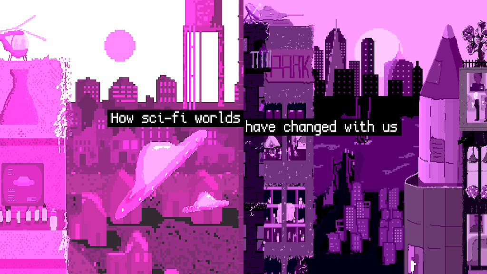

# Análisis Webstory

**Nombre: Who killed the world?**

**URL: https://pudding.cool/2024/07/scifi/**

La webstory comienza con una invitación a posicionarnos en un mundo de ciencia ficción ambientado en 1950, con la intención de observar cómo han cambiado las películas y series del género desde entonces hasta el presente, considerando aquellas que se han ubicado entre las 200 del ranking de IMDb.

La investigación logra captar el interés desde el título, que remite al lector a uno de los tópicos más comunes en las películas de ciencia ficción: un mundo destruido por diversos motivos. Esto se complementa con la ilustración que acompaña el relato, la cual se transforma en función de lo que se narra. De esta manera, la introducción al contenido resulta literaria y muy similar a la experiencia de adentrarse en una historia de sci-fi, lo que fue precisamente lo que me cautivó del sitio, que está dirigido a amantes del género como público objetivo. Además, logra que la información no se perciba como algo lejano o frío, sino significativo.

<video src="imagenes/video ilustrativo.mov" controls="controls" width="600" height="400"></video>

Una vez recorrido este camino, se llega a los datos, donde se presenta una variedad de gráficos que comparan las décadas a partir de una idea como “Configuración de la historia marcada por el sufrimiento”. En su mayoría, estos gráficos presentan comparaciones por décadas mediante distribuciones visuales que permiten identificar tendencias generales más que datos exactos. Estos resultan altamente pertinentes al tema y su elaboración fue posible gracias al aporte de la IA que, en este caso particular, resulta enriquecedora para la investigación, en conjunto con el criterio de selección de Alvin Chang.

Además de la investigación disponible en el sitio web _The Pudding_, se realizó un video con los contenidos que allí se presentan y que no solo replica lo ya expuesto, sino que constituye un aporte ejemplificador. Tanto al inicio como al finalizar el recorrido, aparece un mensaje que redirige al video de YouTube, donde se expone el trabajo, pero incorporando ejemplos de películas que no se mencionan en el material web, mostrando fragmentos de cintas como _Blade Runner_ (1982) e _Interstellar_ (2014).

Ahora bien, la investigación podría haber profundizado en más datos y en artículos vinculados al tema para alcanzar un mayor nivel de análisis y lograr que las ideas de Chang tuvieran un peso más sólido, no solo desde su propio interés, sino también en la fundamentación de su trabajo y su perspectiva. Por tanto, aunque los datos presentados fueron pertinentes e incluso interesantes, se pudo haber profundizado más, incorporando imágenes de las series o películas correspondientes a cada año, o bien ampliando el estudio mediante la comparación del puesto número uno entre las 200 obras de cada década, con el fin de evidenciar cuánto han cambiado.

En lo que respecta a la relación entre imágenes y texto, el resultado es adecuado. Puede resultar algo complejo al inicio adaptarse a una propuesta donde predomina lo visual por sobre lo escrito, pero una vez que se comprende su lógica, esta percepción cambia. La interfaz es cómoda, ya que solo requiere desplazarse hacia abajo de manera constante, lo que la hace bastante intuitiva. Aunque no haya mayor interacción por parte del usuario más allá de esta acción, es gracias al contenido visual que en ningún momento la experiencia se vuelve monótona, debido al constante movimiento que realiza el lector y su efecto en la pantalla.

En suma, Who killed the world? logra transmitir información de manera efectiva sin que el contenido se vuelva tedioso o incomprensible, sino más bien claro y dinámico. Su gran fortaleza se encuentra en la originalidad al momento de presentar los contenidos y en la relación entre texto e ilustración que deriva en datos. No obstante, faltó una mayor profundización en el análisis, así como en los motivos asociados y posibles líneas de interés, para que el tema trascendiera la mera curiosidad y se consolidara como un aporte relevante para la comunidad de la ciencia ficción.

